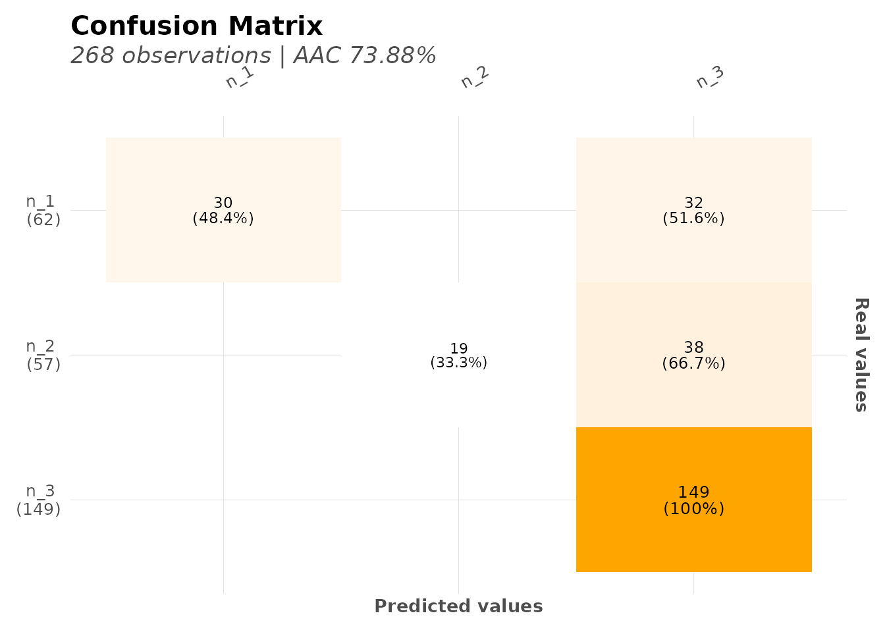
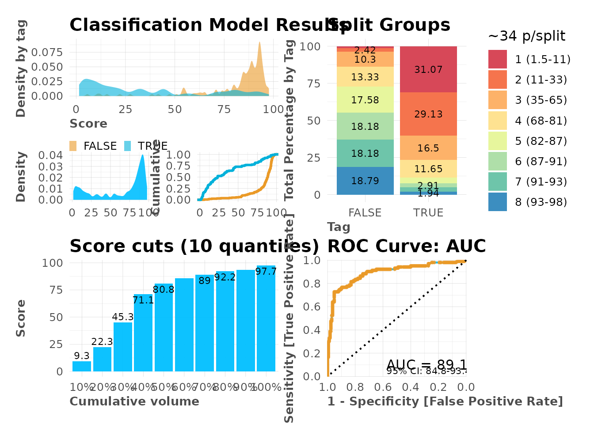
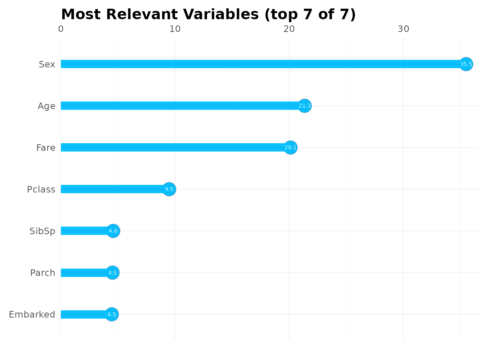

# Machine Learning

## Introduction

The `lares` package provides a streamlined interface to h2o’s AutoML for
automated machine learning. This vignette demonstrates how to build,
evaluate, and interpret models with minimal code.

## Setup

Install and load required packages:

``` r
library(lares)
library(dplyr)
```

h2o must be installed separately:

``` r
# Install h2o (run once)
# install.packages("h2o")
library(h2o)

# Initialize h2o quietly for vignette
h2o.init(nthreads = -1, max_mem_size = "2G")
#> 
#> H2O is not running yet, starting it now...
#> 
#> Note:  In case of errors look at the following log files:
#>     /tmp/RtmpUogh8o/file25986fd68e3f/h2o_runner_started_from_r.out
#>     /tmp/RtmpUogh8o/file2598709da87b/h2o_runner_started_from_r.err
#> 
#> 
#> Starting H2O JVM and connecting: ... Connection successful!
#> 
#> R is connected to the H2O cluster: 
#>     H2O cluster uptime:         1 seconds 617 milliseconds 
#>     H2O cluster timezone:       UTC 
#>     H2O data parsing timezone:  UTC 
#>     H2O cluster version:        3.44.0.3 
#>     H2O cluster version age:    1 year, 11 months and 4 days 
#>     H2O cluster name:           H2O_started_from_R_runner_mwl453 
#>     H2O cluster total nodes:    1 
#>     H2O cluster total memory:   2.00 GB 
#>     H2O cluster total cores:    4 
#>     H2O cluster allowed cores:  4 
#>     H2O cluster healthy:        TRUE 
#>     H2O Connection ip:          localhost 
#>     H2O Connection port:        54321 
#>     H2O Connection proxy:       NA 
#>     H2O Internal Security:      FALSE 
#>     R Version:                  R version 4.5.2 (2025-10-31)
h2o.no_progress() # Disable progress bars
```

## Pipeline


In short, these are the steps that happen on `h2o_automl`’s backend:

1.  **Input Processing**: The function receives a dataframe `df` and the
    dependent variable `y` to predict. Set `seed` for reproducibility.

2.  **Model Type Detection**: Automatically decides between
    classification (categorical) or regression (continuous) based on
    `y`’s class and unique values (controlled by `thresh` parameter).

3.  **Data Splitting**: Splits data into test and train datasets.
    Control the proportion with `split` parameter. Replicate this with
    [`msplit()`](https://laresbernardo.github.io/lares/reference/msplit.md).

4.  **Preprocessing**:

    - Center and scale numerical values
    - Remove outliers with `no_outliers`
    - Impute missing values with MICE (`impute = TRUE`)
    - Balance training data for classification (`balance = TRUE`)
    - Replicate with
      [`model_preprocess()`](https://laresbernardo.github.io/lares/reference/model_preprocess.md)

5.  **Model Training**: Runs
    [`h2o::h2o.automl()`](https://rdrr.io/pkg/h2o/man/h2o.automl.html)
    to train multiple models and generate a leaderboard sorted by
    performance. Customize with:

    - `max_models` or `max_time`
    - `nfolds` for k-fold cross-validation
    - `exclude_algos` and `include_algos`

6.  **Model Selection**: Selects the best model based on performance
    metric (change with `stopping_metric`). Use
    [`h2o_selectmodel()`](https://laresbernardo.github.io/lares/reference/h2o_selectmodel.md)
    to choose an alternative.

7.  **Performance Evaluation**: Calculates metrics and plots using test
    predictions (unseen data). Replicate with
    [`model_metrics()`](https://laresbernardo.github.io/lares/reference/model_metrics.md).

8.  **Results**: Returns a list with inputs, leaderboard, best model,
    metrics, and plots. Export with
    [`export_results()`](https://laresbernardo.github.io/lares/reference/export_results.md).

## Quick Start: Binary Classification

Let’s build a model to predict Titanic survival:

``` r
data(dft)

# Train an AutoML model
# Binary classification
model <- h2o_automl(
  df = dft,
  y = "Survived",
  max_models = 10,
  max_time = 120,
  impute = FALSE, # Set TRUE to use MICE imputation (requires mice package)
  target = "TRUE"
)
#> # A tibble: 2 × 5
#>   tag       n     p order  pcum
#>   <lgl> <int> <dbl> <int> <dbl>
#> 1 FALSE   549  61.6     1  61.6
#> 2 TRUE    342  38.4     2 100
#> train_size  test_size 
#>        623        268
#>                             model_id       auc   logloss     aucpr
#> 1     GLM_1_AutoML_1_20251124_193034 0.8699841 0.4228230 0.8192417
#> 2 XGBoost_1_AutoML_1_20251124_193034 0.8558074 0.4445878 0.8002379
#> 3     DRF_1_AutoML_1_20251124_193034 0.8513537 1.0500736 0.7633683
#>   mean_per_class_error      rmse       mse
#> 1            0.1994995 0.3641748 0.1326233
#> 2            0.2103911 0.3751306 0.1407230
#> 3            0.1899749 0.4062189 0.1650138
#>   |                                                                              |                                                                      |   0%  |                                                                              |======================================================================| 100%
#>   |                                                                              |                                                                      |   0%  |                                                                              |======================================================================| 100%
#> Model (1/10): GLM_1_AutoML_1_20251124_193034
#> Dependent Variable: Survived
#> Type: Classification (2 classes)
#> Algorithm: GLM
#> Split: 70% training data (of 891 observations)
#> Seed: 0
#> 
#> Test metrics:
#>    AUC = 0.83147
#>    ACC = 0.30597
#>    PRC = 0.16071
#>    TPR = 0.16364
#>    TNR = 0.40506
#> 
#> Most important variables:
#>    Ticket.1601 (1.1%)
#>    Ticket.C.A. 37671 (0.8%)
#>    Sex.female (0.8%)
#>    Sex.male (0.8%)
#>    Ticket.347077 (0.7%)

# View results
print(model)
#> Model (1/10): GLM_1_AutoML_1_20251124_193034
#> Dependent Variable: Survived
#> Type: Classification (2 classes)
#> Algorithm: GLM
#> Split: 70% training data (of 891 observations)
#> Seed: 0
#> 
#> Test metrics:
#>    AUC = 0.83147
#>    ACC = 0.30597
#>    PRC = 0.16071
#>    TPR = 0.16364
#>    TNR = 0.40506
#> 
#> Most important variables:
#>    Ticket.1601 (1.1%)
#>    Ticket.C.A. 37671 (0.8%)
#>    Sex.female (0.8%)
#>    Sex.male (0.8%)
#>    Ticket.347077 (0.7%)
```

That’s it!
[`h2o_automl()`](https://laresbernardo.github.io/lares/reference/h2o_automl.md)
handles: - Train/test split - One-hot encoding of categorical
variables - Model training with multiple algorithms - Hyperparameter
tuning - Model selection

## Understanding the Output

The model object contains:

``` r
names(model)
#>  [1] "model"           "y"               "scores_test"     "metrics"        
#>  [5] "parameters"      "importance"      "datasets"        "scoring_history"
#>  [9] "categoricals"    "type"            "split"           "threshold"      
#> [13] "model_name"      "algorithm"       "leaderboard"     "project"        
#> [17] "seed"            "h2o"             "plots"
```

Key components: - `model`: Best h2o model - `metrics`: Performance
metrics - `importance`: Variable importance - `datasets`: Train/test
data used - `parameters`: Configuration used

## Model Performance

### Metrics

View detailed metrics:

``` r
# All metrics
model$metrics
#> $dictionary
#> [1] "AUC: Area Under the Curve"                                                             
#> [2] "ACC: Accuracy"                                                                         
#> [3] "PRC: Precision = Positive Predictive Value"                                            
#> [4] "TPR: Sensitivity = Recall = Hit rate = True Positive Rate"                             
#> [5] "TNR: Specificity = Selectivity = True Negative Rate"                                   
#> [6] "Logloss (Error): Logarithmic loss [Neutral classification: 0.69315]"                   
#> [7] "Gain: When best n deciles selected, what % of the real target observations are picked?"
#> [8] "Lift: When best n deciles selected, how much better than random is?"                   
#> 
#> $confusion_matrix
#>        Pred
#> Real    FALSE TRUE
#>   FALSE    64   94
#>   TRUE     92   18
#> 
#> $gain_lift
#> # A tibble: 10 × 10
#>    percentile value random target total  gain optimal   lift response  score
#>    <fct>      <chr>  <dbl>  <int> <int> <dbl>   <dbl>  <dbl>    <dbl>  <dbl>
#>  1 1          TRUE    10.1     26    27  23.6    24.5 135.      23.6  97.1  
#>  2 2          TRUE    20.1     22    27  43.6    49.1 117.      20    93.2  
#>  3 3          TRUE    30.2     18    27  60      73.6  98.5     16.4  87.9  
#>  4 4          TRUE    39.9     15    26  73.6    97.3  84.4     13.6  77.7  
#>  5 5          TRUE    50        8    27  80.9   100    61.8      7.27 62.6  
#>  6 6          TRUE    60.1      4    27  84.5   100    40.7      3.64 48.5  
#>  7 7          TRUE    69.8      6    26  90     100    29.0      5.45 42.4  
#>  8 8          TRUE    79.9      2    27  91.8   100    15.0      1.82 36.2  
#>  9 9          TRUE    89.9      6    27  97.3   100     8.17     5.45 21.6  
#> 10 10         TRUE   100        3    27 100     100     0        2.73  0.751
#> 
#> $metrics
#>       AUC     ACC     PRC     TPR     TNR
#> 1 0.83147 0.30597 0.16071 0.16364 0.40506
#> 
#> $cv_metrics
#> # A tibble: 22 × 8
#>    metric     mean     sd cv_1_valid cv_2_valid cv_3_valid cv_4_valid cv_5_valid
#>    <chr>     <dbl>  <dbl>      <dbl>      <dbl>      <dbl>      <dbl>      <dbl>
#>  1 accuracy  0.830 0.0435      0.848      0.784      0.784      0.879      0.855
#>  2 auc       0.877 0.0313      0.868      0.880      0.828      0.902      0.905
#>  3 err       0.170 0.0435      0.152      0.216      0.216      0.121      0.145
#>  4 err_cou… 21.2   5.50       19         27         27         15         18    
#>  5 f0point5  0.773 0.0844      0.797      0.640      0.752      0.863      0.813
#>  6 f1        0.774 0.0538      0.753      0.710      0.748      0.819      0.839
#>  7 f2        0.780 0.0582      0.714      0.797      0.743      0.780      0.867
#>  8 lift_to…  2.41  0.510       2.98       1.64       2.31       2.76       2.34 
#>  9 logloss   0.423 0.0514      0.420      0.424      0.506      0.371      0.393
#> 10 max_per…  0.247 0.0505      0.310      0.253      0.259      0.244      0.169
#> # ℹ 12 more rows
#> 
#> $max_metrics
#>                         metric   threshold       value idx
#> 1                       max f1 0.397387367   0.7494737 182
#> 2                       max f2 0.210748279   0.8083596 254
#> 3                 max f0point5 0.708579153   0.7989691  90
#> 4                 max accuracy 0.505773856   0.8218299 149
#> 5                max precision 0.886615048   0.9672131  38
#> 6                   max recall 0.047175178   1.0000000 375
#> 7              max specificity 0.989924900   0.9974425   0
#> 8             max absolute_mcc 0.505773856   0.6123614 149
#> 9   max min_per_class_accuracy 0.344723188   0.7877238 198
#> 10 max mean_per_class_accuracy 0.397387367   0.8005005 182
#> 11                     max tns 0.989924900 390.0000000   0
#> 12                     max fns 0.989924900 232.0000000   0
#> 13                     max fps 0.003791211 391.0000000 399
#> 14                     max tps 0.047175178 232.0000000 375
#> 15                     max tnr 0.989924900   0.9974425   0
#> 16                     max fnr 0.989924900   1.0000000   0
#> 17                     max fpr 0.003791211   1.0000000 399
#> 18                     max tpr 0.047175178   1.0000000 375

# Specific metrics
model$metrics$AUC
#> NULL
model$metrics$Accuracy
#> NULL
model$metrics$Logloss
#> NULL
```

### Confusion Matrix

``` r
# Confusion matrix plot
mplot_conf(
  tag = model$scores_test$tag,
  score = model$scores_test$score,
  subtitle = sprintf("AUC: %.3f", model$metrics$metrics$AUC)
)
```


### ROC Curve

``` r
# ROC curve
mplot_roc(
  tag = model$scores_test$tag,
  score = model$scores_test$score
)
```


### Gain and Lift Charts

``` r
# Gain and Lift charts for binary classification
mplot_gain(
  tag = model$scores_test$tag,
  score = model$scores_test$score
)
```


## Variable Importance

See which features matter most:

``` r
# Variable importance dataframe
head(model$importance, 15)
#>                    variable relative_importance scaled_importance  importance
#> 1               Ticket.1601            2.043497         1.0000000 0.011023368
#> 2         Ticket.C.A. 37671            1.522223         0.7449107 0.008211425
#> 3                Sex.female            1.421250         0.6954992 0.007666743
#> 4                  Sex.male            1.392674         0.6815152 0.007512592
#> 5             Ticket.347077            1.311348         0.6417175 0.007073888
#> 6             Ticket.367226            1.236230         0.6049581 0.006668675
#> 7             Ticket.347054            1.177082         0.5760138 0.006349612
#> 8             Ticket.347082            1.168587         0.5718565 0.006303785
#> 9               Ticket.2678            1.158702         0.5670191 0.006250460
#> 10              Ticket.7598            1.092944         0.5348403 0.005895741
#> 11                   Cabin.            1.088916         0.5328689 0.005874009
#> 12             Ticket.29106            1.081590         0.5292840 0.005834492
#> 13 Ticket.STON/O 2. 3101289            1.069045         0.5231450 0.005766820
#> 14            Ticket.347083            1.031387         0.5047169 0.005563680
#> 15            Ticket.347089            1.030504         0.5042847 0.005558915

# Plot top 15 important variables
top15 <- head(model$importance, 15)
mplot_importance(
  var = top15$variable,
  imp = top15$importance
)
```


## Model Interpretation with SHAP

SHAP values explain individual predictions:

``` r
# Calculate SHAP values (computationally expensive)
shap <- h2o_shap(model)

# Plot SHAP summary
plot(shap)
```

## Advanced: Customizing AutoML

### Preprocessing Options

``` r
model <- h2o_automl(
  df = dft,
  y = "Survived",
  # Data split
  split = 0.7,
  # Handle imbalanced data
  balance = TRUE,
  # Remove outliers (Z-score > 3)
  no_outliers = TRUE,
  # Impute missing values (requires mice package if TRUE)
  impute = FALSE,
  # Keep only unique training rows
  unique_train = TRUE,
  # Ignore specific columns
  ignore = c("PassengerId", "Name", "Ticket")
)
#> # A tibble: 2 × 5
#>   tag       n     p order  pcum
#>   <lgl> <int> <dbl> <int> <dbl>
#> 1 FALSE   549  61.6     1  61.6
#> 2 TRUE    342  38.4     2 100
#> train_size  test_size 
#>        623        268
#>                             model_id       auc   logloss     aucpr
#> 1 XGBoost_1_AutoML_2_20251124_193103 0.8377463 0.4560571 0.8160543
#> 2     GLM_1_AutoML_2_20251124_193103 0.8361554 0.4620718 0.8207185
#> 3     GBM_1_AutoML_2_20251124_193103 0.8336275 0.4836041 0.8116186
#>   mean_per_class_error      rmse       mse
#> 1            0.2084750 0.3775965 0.1425791
#> 2            0.2032231 0.3816752 0.1456760
#> 3            0.2355409 0.3938464 0.1551150
#>   |                                                                              |                                                                      |   0%  |                                                                              |======================================================================| 100%
#>   |                                                                              |                                                                      |   0%  |                                                                              |======================================================================| 100%
#> Model (1/3): XGBoost_1_AutoML_2_20251124_193103
#> Dependent Variable: Survived
#> Type: Classification (2 classes)
#> Algorithm: XGBOOST
#> Split: 70% training data (of 891 observations)
#> Seed: 0
#> 
#> Test metrics:
#>    AUC = 0.87187
#>    ACC = 0.83582
#>    PRC = 0.85542
#>    TPR = 0.68932
#>    TNR = 0.92727
#> 
#> Most important variables:
#>    Sex.male (24.7%)
#>    Sex.female (22%)
#>    Pclass.3 (13%)
#>    Age (11.2%)
#>    Fare (9.9%)
```

### Algorithm Selection

``` r
# Use only specific algorithms
model_rf <- h2o_automl(
  df = dft,
  y = "Survived",
  include_algos = c("GBM", "DRF"), # Gradient Boosting & Random Forest
  max_models = 5
)
#> # A tibble: 2 × 5
#>   tag       n     p order  pcum
#>   <lgl> <int> <dbl> <int> <dbl>
#> 1 FALSE   549  61.6     1  61.6
#> 2 TRUE    342  38.4     2 100
#> train_size  test_size 
#>        623        268
#>                         model_id       auc   logloss     aucpr
#> 1 GBM_3_AutoML_3_20251124_193113 0.8645854 0.5134859 0.8100255
#> 2 GBM_2_AutoML_3_20251124_193113 0.8507630 0.5597124 0.7941386
#> 3 GBM_4_AutoML_3_20251124_193113 0.8424007 0.5379671 0.7881927
#>   mean_per_class_error      rmse       mse
#> 1            0.1773573 0.4112747 0.1691469
#> 2            0.1795763 0.4359639 0.1900645
#> 3            0.1830196 0.4234422 0.1793033
#>   |                                                                              |                                                                      |   0%  |                                                                              |======================================================================| 100%
#>   |                                                                              |                                                                      |   0%  |                                                                              |======================================================================| 100%
#> Model (1/5): GBM_3_AutoML_3_20251124_193113
#> Dependent Variable: Survived
#> Type: Classification (2 classes)
#> Algorithm: GBM
#> Split: 70% training data (of 891 observations)
#> Seed: 0
#> 
#> Test metrics:
#>    AUC = 0.83214
#>    ACC = 0.6791
#>    PRC = 0.72093
#>    TPR = 0.29524
#>    TNR = 0.92638
#> 
#> Most important variables:
#>    Ticket (57.3%)
#>    Sex (18.8%)
#>    Cabin (14.7%)
#>    Age (3.2%)
#>    Pclass (2.5%)

# Exclude specific algorithms
model_no_dl <- h2o_automl(
  df = dft,
  y = "Survived",
  exclude_algos = c("DeepLearning"),
  max_models = 10
)
#> # A tibble: 2 × 5
#>   tag       n     p order  pcum
#>   <lgl> <int> <dbl> <int> <dbl>
#> 1 FALSE   549  61.6     1  61.6
#> 2 TRUE    342  38.4     2 100
#> train_size  test_size 
#>        623        268
#>                                                  model_id       auc   logloss
#> 1    StackedEnsemble_AllModels_1_AutoML_4_20251124_193120 0.8652643 0.4167762
#> 2                          DRF_1_AutoML_4_20251124_193120 0.8638642 0.9250470
#> 3 StackedEnsemble_BestOfFamily_1_AutoML_4_20251124_193120 0.8630579 0.4230030
#>       aucpr mean_per_class_error      rmse       mse
#> 1 0.8536071            0.1910521 0.3608505 0.1302131
#> 2 0.8234600            0.1748278 0.3925871 0.1541246
#> 3 0.8487459            0.1923978 0.3630551 0.1318090
#>   |                                                                              |                                                                      |   0%  |                                                                              |======================================================================| 100%
#>   |                                                                              |                                                                      |   0%  |                                                                              |======================================================================| 100%
#> Model (1/12): StackedEnsemble_AllModels_1_AutoML_4_20251124_193120
#> Dependent Variable: Survived
#> Type: Classification (2 classes)
#> Algorithm: STACKEDENSEMBLE
#> Split: 70% training data (of 891 observations)
#> Seed: 0
#> 
#> Test metrics:
#>    AUC = 0.88726
#>    ACC = 0.82463
#>    PRC = 0.85
#>    TPR = 0.66019
#>    TNR = 0.92727
```

### Seed for Reproducibility

``` r
model <- h2o_automl(
  df = dft,
  y = "Survived",
  seed = 123 # Reproducible results
)
#> # A tibble: 2 × 5
#>   tag       n     p order  pcum
#>   <lgl> <int> <dbl> <int> <dbl>
#> 1 FALSE   549  61.6     1  61.6
#> 2 TRUE    342  38.4     2 100
#> train_size  test_size 
#>        623        268
#>                             model_id       auc   logloss     aucpr
#> 1     GLM_1_AutoML_5_20251124_193144 0.8566401 0.4331878 0.8468753
#> 2 XGBoost_1_AutoML_5_20251124_193144 0.8454934 0.4493601 0.8102068
#> 3     GBM_1_AutoML_5_20251124_193144 0.8088444 0.6286836 0.7275233
#>   mean_per_class_error      rmse       mse
#> 1            0.1914171 0.3680368 0.1354511
#> 2            0.2036480 0.3743833 0.1401629
#> 3            0.2309482 0.4661593 0.2173045
#>   |                                                                              |                                                                      |   0%  |                                                                              |======================================================================| 100%
#>   |                                                                              |                                                                      |   0%  |                                                                              |======================================================================| 100%
#> Model (1/3): GLM_1_AutoML_5_20251124_193144
#> Dependent Variable: Survived
#> Type: Classification (2 classes)
#> Algorithm: GLM
#> Split: 70% training data (of 891 observations)
#> Seed: 123
#> 
#> Test metrics:
#>    AUC = 0.87979
#>    ACC = 0.79851
#>    PRC = 0.90164
#>    TPR = 0.53398
#>    TNR = 0.96364
#> 
#> Most important variables:
#>    Ticket.1601 (0.9%)
#>    Ticket.2661 (0.9%)
#>    Ticket.C.A. 37671 (0.8%)
#>    Cabin.C22 C26 (0.8%)
#>    Sex.female (0.7%)
```

## Multi-Class Classification

Predict passenger class (3 categories):

``` r
model_multiclass <- h2o_automl(
  df = dft,
  y = "Pclass",
  ignore = c("Fare", "Cabin"),
  max_models = 10,
  max_time = 60
)
#> # A tibble: 3 × 5
#>   tag       n     p order  pcum
#>   <fct> <int> <dbl> <int> <dbl>
#> 1 n_3     491  55.1     1  55.1
#> 2 n_1     216  24.2     2  79.4
#> 3 n_2     184  20.6     3 100
#> train_size  test_size 
#>        623        268
#>                         model_id mean_per_class_error   logloss      rmse
#> 1 DRF_1_AutoML_6_20251124_193154            0.4514265 2.1881142 0.5149851
#> 2 GBM_4_AutoML_6_20251124_193154            0.4596244 0.8911328 0.5206654
#> 3 GBM_2_AutoML_6_20251124_193154            0.4596244 0.9079795 0.5237358
#>         mse
#> 1 0.2652097
#> 2 0.2710924
#> 3 0.2742992
#>   |                                                                              |                                                                      |   0%  |                                                                              |======================================================================| 100%
#>   |                                                                              |                                                                      |   0%  |                                                                              |======================================================================| 100%
#> Model (1/10): DRF_1_AutoML_6_20251124_193154
#> Dependent Variable: Pclass
#> Type: Classification (3 classes)
#> Algorithm: DRF
#> Split: 70% training data (of 891 observations)
#> Seed: 0
#> 
#> Test metrics:
#>    AUC = 0.835
#>    ACC = 0.73881
#> 
#> Most important variables:
#>    Ticket (85.3%)
#>    Age (5.9%)
#>    Embarked (3%)
#>    Survived (2.3%)
#>    PassengerId (1.8%)

# Multi-class metrics
model_multiclass$metrics
#> $dictionary
#> [1] "AUC: Area Under the Curve"                                                             
#> [2] "ACC: Accuracy"                                                                         
#> [3] "PRC: Precision = Positive Predictive Value"                                            
#> [4] "TPR: Sensitivity = Recall = Hit rate = True Positive Rate"                             
#> [5] "TNR: Specificity = Selectivity = True Negative Rate"                                   
#> [6] "Logloss (Error): Logarithmic loss [Neutral classification: 0.69315]"                   
#> [7] "Gain: When best n deciles selected, what % of the real target observations are picked?"
#> [8] "Lift: When best n deciles selected, how much better than random is?"                   
#> 
#> $confusion_matrix
#> # A tibble: 3 × 4
#>   `Real x Pred`   n_3   n_1   n_2
#>   <fct>         <int> <int> <int>
#> 1 n_3             149     0     0
#> 2 n_1              32    30     0
#> 3 n_2              38     0    19
#> 
#> $metrics
#>     AUC     ACC
#> 1 0.835 0.73881
#> 
#> $metrics_tags
#> # A tibble: 3 × 9
#>   tag       n     p   AUC order   ACC   PRC   TPR   TNR
#>   <chr> <dbl> <dbl> <dbl> <dbl> <dbl> <dbl> <dbl> <dbl>
#> 1 n_3     149  55.6 0.857     1 0.739 0.680 1     0.412
#> 2 n_1      62  23.1 0.922     2 0.881 1     0.484 1    
#> 3 n_2      57  21.3 0.726     3 0.858 1     0.333 1    
#> 
#> $cv_metrics
#> # A tibble: 12 × 8
#>    metric     mean     sd cv_1_valid cv_2_valid cv_3_valid cv_4_valid cv_5_valid
#>    <chr>     <dbl>  <dbl>      <dbl>      <dbl>      <dbl>      <dbl>      <dbl>
#>  1 accura…   0.697 0.0287      0.728      0.664      0.704      0.669      0.718
#>  2 auc     NaN     0         NaN        NaN        NaN        NaN        NaN    
#>  3 err       0.303 0.0287      0.272      0.336      0.296      0.331      0.282
#>  4 err_co…  37.8   3.56       34         42         37         41         35    
#>  5 logloss   2.19  0.215       2.06       2.02       2.30       2.52       2.05 
#>  6 max_pe…   0.725 0.0173      0.739      0.708      0.704      0.733      0.739
#>  7 mean_p…   0.549 0.0126      0.536      0.545      0.565      0.558      0.539
#>  8 mean_p…   0.451 0.0126      0.464      0.455      0.435      0.442      0.461
#>  9 mse       0.265 0.0347      0.230      0.298      0.274      0.297      0.228
#> 10 pr_auc  NaN     0         NaN        NaN        NaN        NaN        NaN    
#> 11 r2        0.622 0.0364      0.650      0.612      0.604      0.576      0.667
#> 12 rmse      0.514 0.0339      0.479      0.546      0.523      0.545      0.477
#> 
#> $hit_ratio
#>   k hit_ratio
#> 1 1 0.6966292
#> 2 2 0.8764045
#> 3 3 1.0000000

# Confusion matrix for multi-class
mplot_conf(
  tag = model_multiclass$scores_test$tag,
  score = model_multiclass$scores_test$score
)
```



## Regression Example

Predict fare prices:

``` r
model_regression <- h2o_automl(
  df = dft,
  y = "Fare",
  max_models = 10,
  exclude_algos = NULL
)
#>    Min. 1st Qu.  Median    Mean 3rd Qu.    Max. 
#>    0.00    7.91   14.45   32.20   31.00  512.33
#> train_size  test_size 
#>        609        262
#>                                                  model_id     rmse      mse
#> 1    StackedEnsemble_AllModels_1_AutoML_7_20251124_193210 11.43342 130.7231
#> 2 StackedEnsemble_BestOfFamily_1_AutoML_7_20251124_193210 12.07742 145.8640
#> 3                          GBM_1_AutoML_7_20251124_193210 14.52611 211.0080
#>        mae     rmsle mean_residual_deviance
#> 1 6.240817 0.4653345               130.7231
#> 2 7.011522 0.4877838               145.8640
#> 3 8.984404       NaN               211.0080
#>   |                                                                              |                                                                      |   0%  |                                                                              |======================================================================| 100%
#>   |                                                                              |                                                                      |   0%  |                                                                              |======================================================================| 100%
#> Model (1/12): StackedEnsemble_AllModels_1_AutoML_7_20251124_193210
#> Dependent Variable: Fare
#> Type: Regression
#> Algorithm: STACKEDENSEMBLE
#> Split: 70% training data (of 871 observations)
#> Seed: 0
#> 
#> Test metrics:
#>    rmse = 6.9954
#>    mae = 4.4921
#>    mape = 0.01428
#>    mse = 48.936
#>    rsq = 0.9364
#>    rsqa = 0.9361

# Regression metrics
model_regression$metrics
#> $dictionary
#> [1] "RMSE: Root Mean Squared Error"       
#> [2] "MAE: Mean Average Error"             
#> [3] "MAPE: Mean Absolute Percentage Error"
#> [4] "MSE: Mean Squared Error"             
#> [5] "RSQ: R Squared"                      
#> [6] "RSQA: Adjusted R Squared"            
#> 
#> $metrics
#>       rmse      mae       mape      mse    rsq   rsqa
#> 1 6.995405 4.492092 0.01427959 48.93569 0.9364 0.9361
#> 
#> $cv_metrics
#> # A tibble: 8 × 8
#>   metric     mean      sd cv_1_valid cv_2_valid cv_3_valid cv_4_valid cv_5_valid
#>   <chr>     <dbl>   <dbl>      <dbl>      <dbl>      <dbl>      <dbl>      <dbl>
#> 1 mae     6.27e+0 8.32e-1      6.16       5.35       6.48       7.55       5.80 
#> 2 mean_r… 1.30e+2 5.21e+1     95.0       64.7      150.       200.       138.   
#> 3 mse     1.30e+2 5.21e+1     95.0       64.7      150.       200.       138.   
#> 4 null_d… 1.19e+5 3.04e+4 122980.     67161.    134804.    145678.    123512.   
#> 5 r2      8.67e-1 2.55e-2      0.903      0.861      0.870      0.832      0.871
#> 6 residu… 1.56e+4 6.00e+3  11872.      8539.     17257.     24394.     15918.   
#> 7 rmse    1.12e+1 2.35e+0      9.75       8.04      12.2       14.1       11.8  
#> 8 rmsle   4.62e-1 9.88e-2      0.531      0.492      0.537      0.454      0.295
```

## Using Pre-Split Data

If you have predefined train/test splits:

``` r
# Create splits
splits <- msplit(dft, size = 0.8, seed = 123)
#> train_size  test_size 
#>        712        179
splits$train$split <- "train"
splits$test$split <- "test"

# Combine
df_split <- rbind(splits$train, splits$test)

# Train using split column
model <- h2o_automl(
  df = df_split,
  y = "Survived",
  train_test = "split",
  max_models = 5
)
#> # A tibble: 2 × 5
#>   tag       n     p order  pcum
#>   <lgl> <int> <dbl> <int> <dbl>
#> 1 FALSE   549  61.6     1  61.6
#> 2 TRUE    342  38.4     2 100
#> 
#>  test train 
#>   179   712
#>                             model_id       auc   logloss     aucpr
#> 1     DRF_1_AutoML_8_20251124_193226 0.8680875 0.7855203 0.8270861
#> 2     GLM_1_AutoML_8_20251124_193226 0.8654726 0.4253319 0.8491966
#> 3 XGBoost_2_AutoML_8_20251124_193226 0.8552476 0.4437635 0.8198820
#>   mean_per_class_error      rmse       mse
#> 1            0.1775527 0.3813365 0.1454175
#> 2            0.1923547 0.3652137 0.1333811
#> 3            0.2036507 0.3736082 0.1395831
#>   |                                                                              |                                                                      |   0%  |                                                                              |======================================================================| 100%
#>   |                                                                              |                                                                      |   0%  |                                                                              |======================================================================| 100%
#> Model (1/5): DRF_1_AutoML_8_20251124_193226
#> Dependent Variable: Survived
#> Type: Classification (2 classes)
#> Algorithm: DRF
#> Split: 80% training data (of 891 observations)
#> Seed: 0
#> 
#> Test metrics:
#>    AUC = 0.85792
#>    ACC = 0.78212
#>    PRC = 0.84783
#>    TPR = 0.5493
#>    TNR = 0.93519
#> 
#> Most important variables:
#>    Ticket (65.7%)
#>    Sex (14.9%)
#>    Cabin (8.7%)
#>    Pclass (3.4%)
#>    Fare (2.7%)
```

## Making Predictions

### On New Data

``` r
# New data (same structure as training)
new_data <- dft[1:10, ]

# Predict
predictions <- h2o_predict_model(new_data, model$model)
head(predictions)
#>   predict     FALSE.        TRUE.
#> 1   FALSE 0.99979242 0.0002075763
#> 2    TRUE 0.02148936 0.9785106383
#> 3    TRUE 0.12765957 0.8723404255
#> 4    TRUE 0.09574468 0.9042553191
#> 5   FALSE 0.99979242 0.0002075763
#> 6   FALSE 0.97851583 0.0214841721
```

### Binary Model Predictions

``` r
# Get probabilities
predictions <- h2o_predict_model(new_data, model$model)
head(predictions)
#>   predict     FALSE.        TRUE.
#> 1   FALSE 0.99979242 0.0002075763
#> 2    TRUE 0.02148936 0.9785106383
#> 3    TRUE 0.12765957 0.8723404255
#> 4    TRUE 0.09574468 0.9042553191
#> 5   FALSE 0.99979242 0.0002075763
#> 6   FALSE 0.97851583 0.0214841721
```

## Model Comparison

### Full Visualization Suite

``` r
# Complete model evaluation plots
mplot_full(
  tag = model$scores_test$tag,
  score = model$scores_test$score,
  subtitle = model$model@algorithm
)
```


### Metrics Comparison

``` r
# Model performance over trees
mplot_metrics(model)
```


## Saving and Loading Models

### Export Results

``` r
# Save model and plots
export_results(model, subdir = "models", thresh = 0.5)
```

This creates: - Model file (.rds) - MOJO file (for production) -
Performance plots - Metrics summary

### Load Saved Model

``` r
# Load model
loaded_model <- readRDS("models/Titanic_Model/Titanic_Model.rds")

# Make predictions with MOJO (production-ready)
predictions <- h2o_predict_MOJO(
  model_path = "models/Titanic_Model",
  df = dft[1:10, ]
)
```

## Best Practices

### 1. Start Simple

``` r
# Quick prototype
model <- h2o_automl(dft, "Survived", max_models = 3, max_time = 30)
#> # A tibble: 2 × 5
#>   tag       n     p order  pcum
#>   <lgl> <int> <dbl> <int> <dbl>
#> 1 FALSE   549  61.6     1  61.6
#> 2 TRUE    342  38.4     2 100
#> train_size  test_size 
#>        623        268
#>                             model_id       auc   logloss     aucpr
#> 1     GLM_1_AutoML_9_20251124_193249 0.8566401 0.4331878 0.8468753
#> 2 XGBoost_1_AutoML_9_20251124_193249 0.8410859 0.4576161 0.8238591
#> 3     GBM_1_AutoML_9_20251124_193249 0.8159377 0.6451460 0.7378534
#>   mean_per_class_error      rmse       mse
#> 1            0.1914171 0.3680368 0.1354511
#> 2            0.2036044 0.3771717 0.1422585
#> 3            0.2218336 0.4732407 0.2239567
#>   |                                                                              |                                                                      |   0%  |                                                                              |======================================================================| 100%
#>   |                                                                              |                                                                      |   0%  |                                                                              |======================================================================| 100%
#> Model (1/3): GLM_1_AutoML_9_20251124_193249
#> Dependent Variable: Survived
#> Type: Classification (2 classes)
#> Algorithm: GLM
#> Split: 70% training data (of 891 observations)
#> Seed: 0
#> 
#> Test metrics:
#>    AUC = 0.87979
#>    ACC = 0.79851
#>    PRC = 0.90164
#>    TPR = 0.53398
#>    TNR = 0.96364
#> 
#> Most important variables:
#>    Ticket.1601 (0.9%)
#>    Ticket.2661 (0.9%)
#>    Ticket.C.A. 37671 (0.8%)
#>    Cabin.C22 C26 (0.8%)
#>    Sex.female (0.7%)
```

### 2. Iterate and Refine

``` r
# Refine based on results
model <- h2o_automl(
  dft, "Survived",
  max_models = 20,
  no_outliers = TRUE,
  balance = TRUE,
  ignore = c("PassengerId", "Name", "Ticket", "Cabin"),
  model_name = "Titanic_Model"
)
#> # A tibble: 2 × 5
#>   tag       n     p order  pcum
#>   <lgl> <int> <dbl> <int> <dbl>
#> 1 FALSE   549  61.6     1  61.6
#> 2 TRUE    342  38.4     2 100
#> train_size  test_size 
#>        623        268
#>                          model_id       auc   logloss     aucpr
#> 1 GBM_3_AutoML_10_20251124_193259 0.8575063 0.4316748 0.8410436
#> 2 GBM_2_AutoML_10_20251124_193259 0.8571250 0.4270731 0.8442881
#> 3 GBM_4_AutoML_10_20251124_193259 0.8561498 0.4266892 0.8469913
#>   mean_per_class_error      rmse       mse
#> 1            0.1887694 0.3656777 0.1337202
#> 2            0.1944735 0.3641046 0.1325721
#> 3            0.1909050 0.3631896 0.1319067
#>   |                                                                              |                                                                      |   0%  |                                                                              |======================================================================| 100%
#>   |                                                                              |                                                                      |   0%  |                                                                              |======================================================================| 100%
```

### 3. Validate Thoroughly

``` r
# Check multiple metrics
model$metrics
#> $dictionary
#> [1] "AUC: Area Under the Curve"                                                             
#> [2] "ACC: Accuracy"                                                                         
#> [3] "PRC: Precision = Positive Predictive Value"                                            
#> [4] "TPR: Sensitivity = Recall = Hit rate = True Positive Rate"                             
#> [5] "TNR: Specificity = Selectivity = True Negative Rate"                                   
#> [6] "Logloss (Error): Logarithmic loss [Neutral classification: 0.69315]"                   
#> [7] "Gain: When best n deciles selected, what % of the real target observations are picked?"
#> [8] "Lift: When best n deciles selected, how much better than random is?"                   
#> 
#> $confusion_matrix
#>        Pred
#> Real    FALSE TRUE
#>   FALSE   156    9
#>   TRUE     28   75
#> 
#> $gain_lift
#> # A tibble: 10 × 10
#>    percentile value random target total  gain optimal  lift response score
#>    <fct>      <fct>  <dbl>  <int> <int> <dbl>   <dbl> <dbl>    <dbl> <dbl>
#>  1 1          FALSE   10.1     25    27  15.2    16.4  50.4   15.2   93.5 
#>  2 2          FALSE   20.1     24    27  29.7    32.7  47.4   14.5   92.2 
#>  3 3          FALSE   30.2     26    27  45.5    49.1  50.4   15.8   89.0 
#>  4 4          FALSE   39.9     24    26  60      64.8  50.3   14.5   86.1 
#>  5 5          FALSE   50       23    27  73.9    81.2  47.9   13.9   81.1 
#>  6 6          FALSE   60.1     17    27  84.2    97.6  40.2   10.3   71.1 
#>  7 7          FALSE   69.8     18    26  95.2   100    36.4   10.9   45.7 
#>  8 8          FALSE   79.9      3    27  97.0   100    21.4    1.82  22.6 
#>  9 9          FALSE   89.9      4    27  99.4   100    10.5    2.42   9.55
#> 10 10         FALSE  100        1    27 100     100     0      0.606  1.49
#> 
#> $metrics
#>       AUC     ACC     PRC     TPR     TNR
#> 1 0.89147 0.86194 0.89286 0.72816 0.94545
#> 
#> $cv_metrics
#> # A tibble: 20 × 8
#>    metric     mean     sd cv_1_valid cv_2_valid cv_3_valid cv_4_valid cv_5_valid
#>    <chr>     <dbl>  <dbl>      <dbl>      <dbl>      <dbl>      <dbl>      <dbl>
#>  1 accuracy  0.836 0.0462      0.84      0.896       0.8        0.782      0.863
#>  2 auc       0.847 0.0721      0.847     0.927       0.854      0.731      0.876
#>  3 err       0.164 0.0462      0.16      0.104       0.2        0.218      0.137
#>  4 err_cou… 20.4   5.73       20        13          25         27         17    
#>  5 f0point5  0.783 0.0914      0.788     0.913       0.743      0.663      0.808
#>  6 f1        0.781 0.0793      0.778     0.876       0.779      0.658      0.813
#>  7 f2        0.780 0.0759      0.768     0.842       0.818      0.653      0.819
#>  8 lift_to…  2.64  0.337       2.72      2.23        2.40       3.1        2.76 
#>  9 logloss   0.432 0.0828      0.452     0.326       0.460      0.543      0.379
#> 10 max_per…  0.236 0.0702      0.239     0.179       0.233      0.35       0.178
#> 11 mcc       0.651 0.110       0.653     0.792       0.605      0.499      0.705
#> 12 mean_pe…  0.824 0.0531      0.823     0.889       0.807      0.748      0.854
#> 13 mean_pe…  0.176 0.0531      0.177     0.111       0.193      0.252      0.146
#> 14 mse       0.134 0.0294      0.139     0.0966      0.145      0.173      0.115
#> 15 pr_auc    0.822 0.0987      0.821     0.937       0.814      0.669      0.870
#> 16 precisi…  0.785 0.103       0.795     0.939       0.721      0.667      0.804
#> 17 r2        0.425 0.149       0.403     0.610       0.402      0.207      0.503
#> 18 recall    0.780 0.0793      0.761     0.821       0.846      0.65       0.822
#> 19 rmse      0.364 0.0405      0.372     0.311       0.381      0.416      0.339
#> 20 specifi…  0.868 0.0693      0.886     0.957       0.767      0.845      0.886
#> 
#> $max_metrics
#>                         metric  threshold       value idx
#> 1                       max f1 0.41714863   0.7672956 181
#> 2                       max f2 0.28931884   0.7898957 224
#> 3                 max f0point5 0.66135190   0.8173619 120
#> 4                 max accuracy 0.61537557   0.8250401 130
#> 5                max precision 0.99256302   1.0000000   0
#> 6                   max recall 0.03108045   1.0000000 391
#> 7              max specificity 0.99256302   1.0000000   0
#> 8             max absolute_mcc 0.61537557   0.6277286 130
#> 9   max min_per_class_accuracy 0.35070798   0.7907950 205
#> 10 max mean_per_class_accuracy 0.41714863   0.8112306 181
#> 11                     max tns 0.99256302 384.0000000   0
#> 12                     max fns 0.99256302 238.0000000   0
#> 13                     max fps 0.01019947 384.0000000 399
#> 14                     max tps 0.03108045 239.0000000 391
#> 15                     max tnr 0.99256302   1.0000000   0
#> 16                     max fnr 0.99256302   0.9958159   0
#> 17                     max fpr 0.01019947   1.0000000 399
#> 18                     max tpr 0.03108045   1.0000000 391

# Visual inspection
mplot_full(
  tag = model$scores_test$tag,
  score = model$scores_test$score
)
```



``` r

# Variable importance
mplot_importance(
  var = model$importance$variable,
  imp = model$importance$importance
)
```



### Score Distribution

``` r
# Density plot
mplot_density(
  tag = model$scores_test$tag,
  score = model$scores_test$score
)
```


### 4. Document Your Process

``` r
# Save everything
export_results(model, subdir = "my_project", thresh = 0.5)
```

## Troubleshooting

### h2o Initialization Issues

``` r
# Manually initialize h2o with more memory
h2o::h2o.init(max_mem_size = "8G", nthreads = -1)
#>  Connection successful!
#> 
#> R is connected to the H2O cluster: 
#>     H2O cluster uptime:         2 minutes 59 seconds 
#>     H2O cluster timezone:       UTC 
#>     H2O data parsing timezone:  UTC 
#>     H2O cluster version:        3.44.0.3 
#>     H2O cluster version age:    1 year, 11 months and 4 days 
#>     H2O cluster name:           H2O_started_from_R_runner_mwl453 
#>     H2O cluster total nodes:    1 
#>     H2O cluster total memory:   1.91 GB 
#>     H2O cluster total cores:    4 
#>     H2O cluster allowed cores:  4 
#>     H2O cluster healthy:        TRUE 
#>     H2O Connection ip:          localhost 
#>     H2O Connection port:        54321 
#>     H2O Connection proxy:       NA 
#>     H2O Internal Security:      FALSE 
#>     R Version:                  R version 4.5.2 (2025-10-31)
```

### Clean h2o Environment

``` r
# Remove all models
h2o::h2o.removeAll()

# Shutdown h2o
h2o::h2o.shutdown(prompt = FALSE)
```

### Check h2o Flow UI

``` r
# Open h2o's web interface
# Navigate to: http://localhost:54321/flow/index.html
```

## Further Reading

### Package & ML Resources

- **h2o AutoML Documentation:**
  <https://docs.h2o.ai/h2o/latest-stable/h2o-docs/automl.html>
- **lares ML functions:**
  [`?h2o_automl`](https://laresbernardo.github.io/lares/reference/h2o_automl.md),
  [`?h2o_explainer`](https://laresbernardo.github.io/lares/reference/h2o_explainer.md),
  [`?mplot_full`](https://laresbernardo.github.io/lares/reference/mplot_full.md)
- **SHAP explanations:** <https://github.com/slundberg/shap>

### Blog Posts & Tutorials

- [Machine Learning Results: One Plot to Rule Them
  All](https://datascienceplus.com/machine-learning-results-one-plot-to-rule-them-all/) -
  Visualizing binary classification results
- [Machine Learning Results in R: One Plot to Rule Them All (Part 2 -
  Regression
  Models)](https://datascienceplus.com/machine-learning-results-in-r-one-plot-to-rule-them-all-part-2-regression-models/) -
  Regression model visualization
- [Understanding Titanic Dataset with H2O’s AutoML, DALEX and lares
  Library](https://datascienceplus.com/understanding-titanic-dataset-with-h2os-automl-dalex-and-lares-library/) -
  Complete Titanic analysis walkthrough
- Other lares articles [on
  DataScience+](https://datascienceplus.com/author/bernardo-lares/)

## Next Steps

- Explore data wrangling features (see Data Wrangling vignette)
- Learn about API integrations (see API Integrations vignette)
- Review individual plotting functions:
  [`?mplot_conf`](https://laresbernardo.github.io/lares/reference/mplot_conf.md),
  [`?mplot_roc`](https://laresbernardo.github.io/lares/reference/mplot_roc.md),
  [`?mplot_importance`](https://laresbernardo.github.io/lares/reference/mplot_importance.md)
