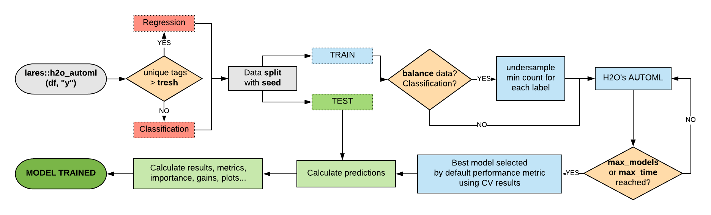

```{r setup, include = FALSE}
knitr::opts_chunk$set(
  collapse = TRUE,
  comment = "#>",
  fig.width = 7,
  fig.height = 5,
  warning = FALSE,
  message = FALSE,
  eval = TRUE, # Show actual results like old vignette
  cache = TRUE, # Cache results to avoid re-running h2o every build
  cache.lazy = FALSE
)
```

## Introduction

The `lares` package provides a streamlined interface to h2o's AutoML for automated machine learning. This vignette demonstrates how to build, evaluate, and interpret models with minimal code.

## Setup

Install and load required packages:

```{r eval=TRUE}
library(lares)
library(dplyr)
```

h2o must be installed separately:

```{r}
# Install h2o (run once)
# install.packages("h2o")
library(h2o)

# Initialize h2o quietly for vignette
h2o.init(nthreads = -1, max_mem_size = "2G")
h2o.no_progress() # Disable progress bars
```

## Quick Start: Binary Classification

Let's build a model to predict Titanic survival:

```{r}
data(dft)

# Train an AutoML model
# Binary classification
model <- h2o_automl(
  df = dft,
  y = "Survived",
  max_models = 10,
  max_time = 120,
  impute = FALSE, # Set TRUE to use MICE imputation (requires mice package)
  target = "TRUE"
)

# View results
print(model)
```

That's it! `h2o_automl()` handles:
- Train/test split
- One-hot encoding of categorical variables
- Model training with multiple algorithms
- Hyperparameter tuning
- Model selection

## Pipeline



In short, these are the steps that happen on `h2o_automl`'s backend:

1. **Input Processing**: The function receives a dataframe `df` and the dependent variable `y` to predict. Set `seed` for reproducibility.

2. **Model Type Detection**: Automatically decides between classification (categorical) or regression (continuous) based on `y`'s class and unique values (controlled by `thresh` parameter).

3. **Data Splitting**: Splits data into test and train datasets. Control the proportion with `split` parameter. Replicate this with `msplit()`.

4. **Preprocessing**: 
   - Center and scale numerical values
   - Remove outliers with `no_outliers`
   - Impute missing values with MICE (`impute = TRUE`)
   - Balance training data for classification (`balance = TRUE`)
   - Replicate with `model_preprocess()`

5. **Model Training**: Runs `h2o::h2o.automl()` to train multiple models and generate a leaderboard sorted by performance. Customize with:
   - `max_models` or `max_time`
   - `nfolds` for k-fold cross-validation
   - `exclude_algos` and `include_algos`

6. **Model Selection**: Selects the best model based on performance metric (change with `stopping_metric`). Use `h2o_selectmodel()` to choose an alternative.

7. **Performance Evaluation**: Calculates metrics and plots using test predictions (unseen data). Replicate with `model_metrics()`.

8. **Results**: Returns a list with inputs, leaderboard, best model, metrics, and plots. Export with `export_results()`.

## Understanding the Output

The model object contains:

```{r}
names(model)
```

Key components:
- `model`: Best h2o model
- `metrics`: Performance metrics
- `importance`: Variable importance
- `datasets`: Train/test data used
- `parameters`: Configuration used

## Model Performance

### Metrics

View detailed metrics:

```{r}
# All metrics
model$metrics

# Specific metrics
model$metrics$AUC
model$metrics$Accuracy
model$metrics$Logloss
```

### Confusion Matrix

```{r}
# Confusion matrix plot
mplot_conf(
  tag = model$scores_test$tag,
  score = model$scores_test$score,
  subtitle = sprintf("AUC: %.3f", model$metrics$metrics$AUC)
)
```

### ROC Curve

```{r}
# ROC curve
mplot_roc(
  tag = model$scores_test$tag,
  score = model$scores_test$score
)
```

### Gain and Lift Charts

```{r}
# Gain and Lift charts for binary classification
mplot_gain(
  tag = model$scores_test$tag,
  score = model$scores_test$score
)
```

## Variable Importance

See which features matter most:

```{r}
# Variable importance dataframe
head(model$importance, 15)

# Plot top 15 important variables
top15 <- head(model$importance, 15)
mplot_importance(
  var = top15$variable,
  imp = top15$importance
)
```

## Model Interpretation with SHAP

SHAP values explain individual predictions:

```{r, eval=FALSE}
# Calculate SHAP values (computationally expensive)
shap <- h2o_shap(model)

# Plot SHAP summary
plot(shap)
```

## Advanced: Customizing AutoML

### Preprocessing Options

```{r}
model <- h2o_automl(
  df = dft,
  y = "Survived",
  # Data split
  split = 0.7,
  # Handle imbalanced data
  balance = TRUE,
  # Remove outliers (Z-score > 3)
  no_outliers = TRUE,
  # Impute missing values (requires mice package if TRUE)
  impute = FALSE,
  # Keep only unique training rows
  unique_train = TRUE,
  # Ignore specific columns
  ignore = c("PassengerId", "Name", "Ticket")
)
```

### Algorithm Selection

```{r}
# Use only specific algorithms
model_rf <- h2o_automl(
  df = dft,
  y = "Survived",
  include_algos = c("GBM", "DRF"), # Gradient Boosting & Random Forest
  max_models = 5
)

# Exclude specific algorithms
model_no_dl <- h2o_automl(
  df = dft,
  y = "Survived",
  exclude_algos = c("DeepLearning"),
  max_models = 10
)
```

### Seed for Reproducibility

```{r}
model <- h2o_automl(
  df = dft,
  y = "Survived",
  seed = 123 # Reproducible results
)
```

## Multi-Class Classification

Predict passenger class (3 categories):

```{r}
model_multiclass <- h2o_automl(
  df = dft,
  y = "Pclass",
  ignore = c("Fare", "Cabin"),
  max_models = 10,
  max_time = 60
)

# Multi-class metrics
model_multiclass$metrics

# Confusion matrix for multi-class
mplot_conf(
  tag = model_multiclass$scores_test$tag,
  score = model_multiclass$scores_test$score
)
```

## Regression Example

Predict fare prices:

```{r}
model_regression <- h2o_automl(
  df = dft,
  y = "Fare",
  max_models = 10,
  exclude_algos = NULL
)

# Regression metrics
model_regression$metrics
```

## Using Pre-Split Data

If you have predefined train/test splits:

```{r}
# Create splits
splits <- msplit(dft, size = 0.8, seed = 123)
splits$train$split <- "train"
splits$test$split <- "test"

# Combine
df_split <- rbind(splits$train, splits$test)

# Train using split column
model <- h2o_automl(
  df = df_split,
  y = "Survived",
  train_test = "split",
  max_models = 5
)
```

## Making Predictions

### On New Data

```{r}
# New data (same structure as training)
new_data <- dft[1:10, ]

# Predict
predictions <- h2o_predict_model(new_data, model$model)
head(predictions)
```

### Binary Model Predictions

```{r}
# Get probabilities
predictions <- h2o_predict_model(new_data, model$model)
head(predictions)
```

## Model Comparison

### Full Visualization Suite

```{r}
# Complete model evaluation plots
mplot_full(
  tag = model$scores_test$tag,
  score = model$scores_test$score,
  subtitle = model$model@algorithm
)
```

### Metrics Comparison

```{r}
# Model performance over trees
mplot_metrics(model)
```

## Saving and Loading Models

### Export Results

```{r}
# Save model and plots
export_results(model, subdir = "models", thresh = 0.5)
```

This creates:
- Model file (.rds)
- MOJO file (for production)
- Performance plots
- Metrics summary

### Load Saved Model

```{r, eval=FALSE}
# Load model
loaded_model <- readRDS("models/Titanic_Model/Titanic_Model.rds")

# Make predictions with MOJO (production-ready)
predictions <- h2o_predict_MOJO(
  model_path = "models/Titanic_Model",
  df = dft[1:10, ]
)
```

## Best Practices

### 1. Start Simple

```{r}
# Quick prototype
model <- h2o_automl(dft, "Survived", max_models = 3, max_time = 30)
```

### 2. Iterate and Refine

```{r}
# Refine based on results
model <- h2o_automl(
  dft, "Survived",
  max_models = 20,
  no_outliers = TRUE,
  balance = TRUE,
  ignore = c("PassengerId", "Name", "Ticket", "Cabin"),
  model_name = "Titanic_Model"
)
```

### 3. Validate Thoroughly

```{r}
# Check multiple metrics
model$metrics

# Visual inspection
mplot_full(
  tag = model$scores_test$tag,
  score = model$scores_test$score
)

# Variable importance
mplot_importance(
  var = model$importance$variable,
  imp = model$importance$importance
)
```

### Score Distribution

```{r}
# Density plot
mplot_density(
  tag = model$scores_test$tag,
  score = model$scores_test$score
)
```

### 4. Document Your Process

```{r}
# Save everything
export_results(model, subdir = "my_project", thresh = 0.5)
```

## Troubleshooting

### h2o Initialization Issues

```{r}
# Manually initialize h2o with more memory
h2o::h2o.init(max_mem_size = "8G", nthreads = -1)
```

### Clean h2o Environment

```{r}
# Remove all models
h2o::h2o.removeAll()

# Shutdown h2o
h2o::h2o.shutdown(prompt = FALSE)
```

### Check h2o Flow UI

```{r}
# Open h2o's web interface
# Navigate to: http://localhost:54321/flow/index.html
```

## Further Reading

### Package & ML Resources
- **h2o AutoML Documentation:** [https://docs.h2o.ai/h2o/latest-stable/h2o-docs/automl.html](https://docs.h2o.ai/h2o/latest-stable/h2o-docs/automl.html)
- **lares ML functions:** `?h2o_automl`, `?h2o_explainer`, `?mplot_full`
- **SHAP explanations:** [https://github.com/slundberg/shap](https://github.com/slundberg/shap)

### Blog Posts & Tutorials
- **[Machine Learning Results: One Plot to Rule Them All](https://datascienceplus.com/machine-learning-results-one-plot-to-rule-them-all/)** - Visualizing binary classification results
- **[Machine Learning Results in R: One Plot to Rule Them All (Part 2 - Regression Models)](https://datascienceplus.com/machine-learning-results-in-r-one-plot-to-rule-them-all-part-2-regression-models/)** - Regression model visualization
- **[Understanding Titanic Dataset with H2O's AutoML, DALEX and lares Library](https://datascienceplus.com/understanding-titanic-dataset-with-h2os-automl-dalex-and-lares-library/)** - Complete Titanic analysis walkthrough
- **All lares articles:** [Author page on DataScience+](https://datascienceplus.com/author/bernardo-lares/)

## Next Steps

- Explore data wrangling features (see Data Wrangling vignette)
- Learn about API integrations (see API Integrations vignette)
- Review individual plotting functions: `?mplot_conf`, `?mplot_roc`, `?mplot_importance`
